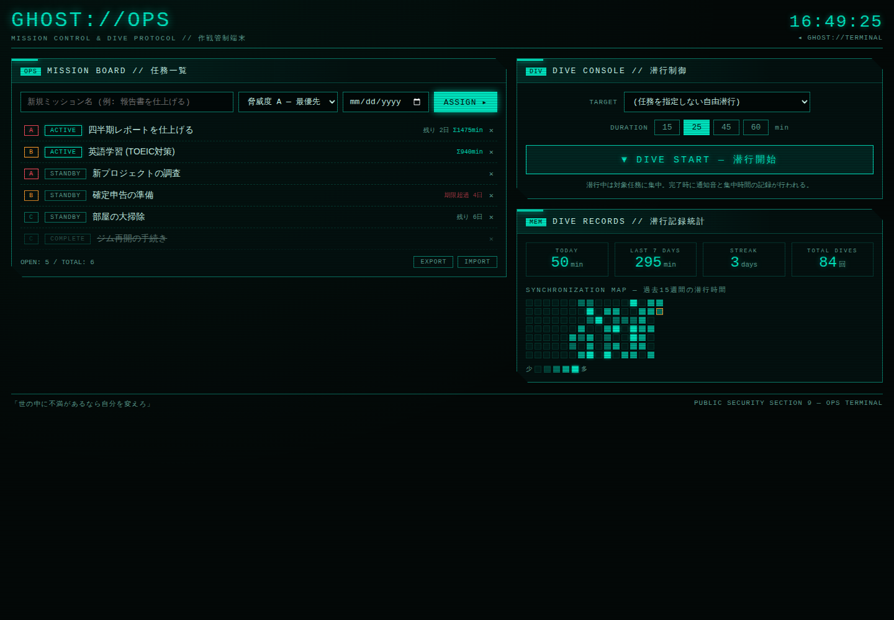

# GHOST:// — 攻殻機動隊風 Webアプリ集

攻殻機動隊の世界観をイメージした Web アプリケーションです。
HTML / CSS / JavaScript のみで動作し、ビルドやAPIキーは不要です。

| アプリ | パス | 内容 |
|---|---|---|
| **GHOST://TERMINAL** | `/` (ルート) | 身の回りの情報を分析・表示する電脳分析端末 |
| **GHOST://OPS** | `/ops/` | タスク管理 + ポモドーロ式集中タイマーの作戦管制端末 |

---

## GHOST://TERMINAL — 電脳分析端末


## パネル構成

| パネル | 内容 |
|---|---|
| **SYSTEM DIAGNOSTICS // 義体状態診断** | OS・ブラウザ・画面・CPUスレッド数・メモリ・回線種別・バッテリー残量・JSヒープ使用量をリアルタイム表示 |
| **GEO / ATMOSPHERE // 環境走査** | 現在地の座標 (位置情報許可時)・天気・気温・湿度・風・気圧 ([Open-Meteo](https://open-meteo.com/) API)・世界時計 |
| **PERSONAL DATA LOG // 外部記憶解析** | 仕事時間・支出などを手入力で記録し、カテゴリ別グラフとログで可視化 (データはブラウザの localStorage に保存) |
| **INTERCEPTED FEED // 傍受通信** | NHKニュースRSS (CORSプロキシ経由)。取得できない場合は Hacker News にフォールバック |

その他: ブートシーケンス、デジタルレイン背景、スキャンライン、グリッチエフェクト、ニューラル波形など。

## 使い方

ローカルサーバーで起動します (位置情報・バッテリーAPIはセキュアコンテキストが必要なため):

```bash
python3 -m http.server 8000
# → http://localhost:8000 をブラウザで開く
```

GitHub Pages にそのままデプロイすることもできます (リポジトリ設定 → Pages → ブランチを選択)。

## 補足

- 位置情報を拒否した場合は東京駅の座標をデフォルトノードとして使用します。
- バッテリー・メモリ・回線情報は対応ブラウザ (主にChromium系) でのみ表示されます。非対応の場合は `N/A` と表示されます。
- 手入力データは外部に送信されず、ブラウザ内にのみ保存されます。

---

## GHOST://OPS — 作戦管制端末 (`/ops/`)

日々のタスク管理と集中時間の記録を「公安9課の任務遂行」として演出する、実用重視のアプリです。



### 機能

| パネル | 内容 |
|---|---|
| **MISSION BOARD // 任務一覧** | タスクを「ミッション」として登録。脅威度 (A/B/C = 優先度)・期限 (残日数カウントダウン、超過は赤点滅)・状態 (STANDBY → ACTIVE → COMPLETE をクリックで遷移)・累計集中時間を表示 |
| **DIVE CONSOLE // 潜行制御** | ポモドーロ式集中タイマー。対象ミッションと時間 (15/25/45/60分) を選んで「潜行」。潜行中は他パネルが減光し、タブタイトルに残り時間を表示。完了時に通知音 (WebAudio) とデスクトップ通知。中断は「緊急浮上」 |
| **DIVE RECORDS // 潜行記録統計** | 今日/直近7日の集中分数、連続日数 (ストリーク)、総潜行回数、過去15週間のヒートマップ (GitHub風) |

### 実利ポイント

- 集中セッションは分単位で自動記録され、ミッション別・日別に集計されます。
- データはすべて localStorage 保存 (外部送信なし)。EXPORT/IMPORT ボタンで JSON バックアップ・復元が可能です。
- 潜行中にページを閉じても、次回アクセス時にセッションが復帰または完了として記録されます。

起動方法はルートと同じです: `python3 -m http.server 8000` → `http://localhost:8000/ops/`
