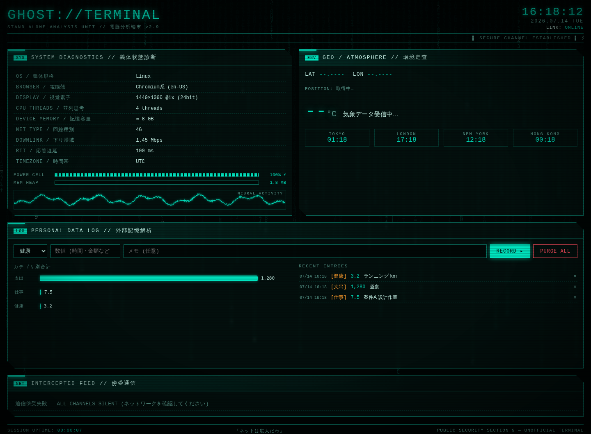

# GHOST://TERMINAL — 電脳分析端末

攻殻機動隊の世界観をイメージした、身の回りの情報を分析・表示する Web アプリケーションです。
HTML / CSS / JavaScript のみで動作し、ビルドやAPIキーは不要です。



## パネル構成

| パネル | 内容 |
|---|---|
| **SYSTEM DIAGNOSTICS // 義体状態診断** | OS・ブラウザ・画面・CPUスレッド数・メモリ・回線種別・バッテリー残量・JSヒープ使用量をリアルタイム表示 |
| **GEO / ATMOSPHERE // 環境走査** | 現在地の座標 (位置情報許可時)・天気・気温・湿度・風・気圧 ([Open-Meteo](https://open-meteo.com/) API)・世界時計 |
| **PERSONAL DATA LOG // 外部記憶解析** | 仕事時間・支出などを手入力で記録し、カテゴリ別グラフとログで可視化 (データはブラウザの localStorage に保存) |
| **INTERCEPTED FEED // 傍受通信** | NHKニュースRSS (CORSプロキシ経由)。取得できない場合は Hacker News にフォールバック |

その他: ブートシーケンス、デジタルレイン背景、スキャンライン、グリッチエフェクト、ニューラル波形など。

## 使い方

ローカルサーバーで起動します (位置情報・バッテリーAPIはセキュアコンテキストが必要なため):

```bash
python3 -m http.server 8000
# → http://localhost:8000 をブラウザで開く
```

GitHub Pages にそのままデプロイすることもできます (リポジトリ設定 → Pages → ブランチを選択)。

## 補足

- 位置情報を拒否した場合は東京駅の座標をデフォルトノードとして使用します。
- バッテリー・メモリ・回線情報は対応ブラウザ (主にChromium系) でのみ表示されます。非対応の場合は `N/A` と表示されます。
- 手入力データは外部に送信されず、ブラウザ内にのみ保存されます。
